## 计算机毕业设计吊炸天hadoop+spark+hive游戏推荐系统 游戏数据分析可视化大屏 steam游戏爬虫 游戏大数据 大数据毕业设计 机器学习 知识图谱 大数据毕业设计 机器学习 预测系统 数据仓库 大数据毕业设计 文本分类 LSTM情感分析 大数据毕业设计 知识图谱 大数据毕业设计 预测系统 实时计算 离线计算 数据仓库 人工智能 神经网络

## 要求
### 源码有偿！一套(论文 PPT 源码+sql脚本+教程)

### 
### 加好友前帮忙start一下，并备注github有偿hive游戏推荐
### 我的QQ号是2827724252或者798059319或者 1679232425或者微信:bysj2023nb

# 

### 加qq好友说明（被部分 网友整得心力交瘁）：
    1.加好友务必按照格式备注
    2.避免浪费各自的时间！
    3.当“客服”不容易，repo 主是体面人，不爆粗，性格好，文明人。

基础版，也就是当前下面连接这个版本(只带hadoop spark hive flask sqoop  hdfs azkaban python爬虫 echarts大屏可视化驾驶舱)

https://www.bilibili.com/video/BV1PV4y1e7rd/?spm_id_from=333.999.0.0

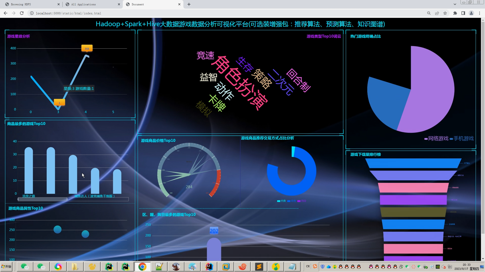
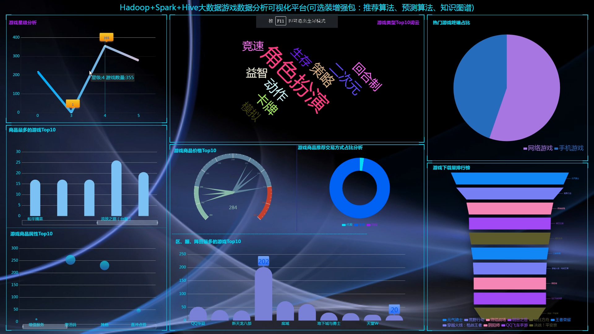
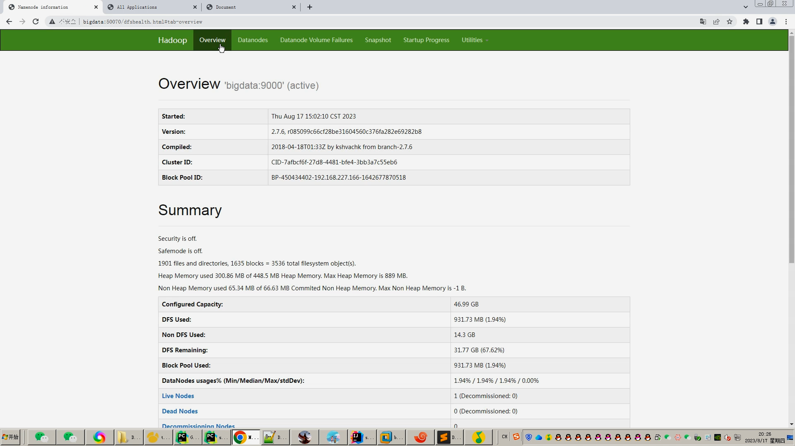
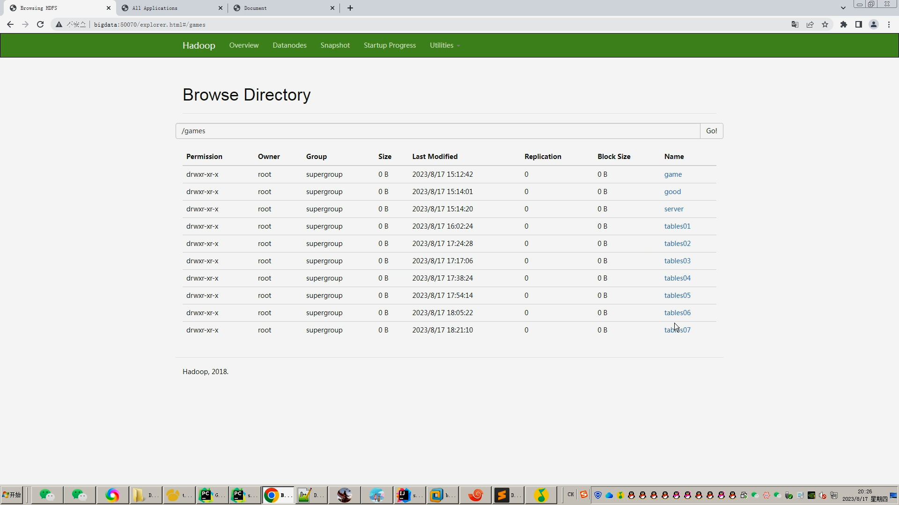
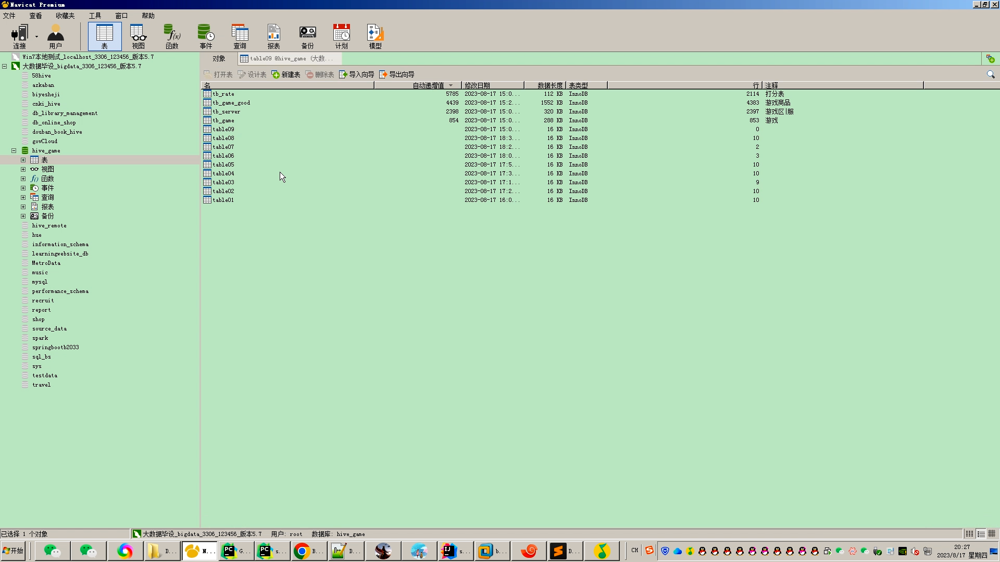
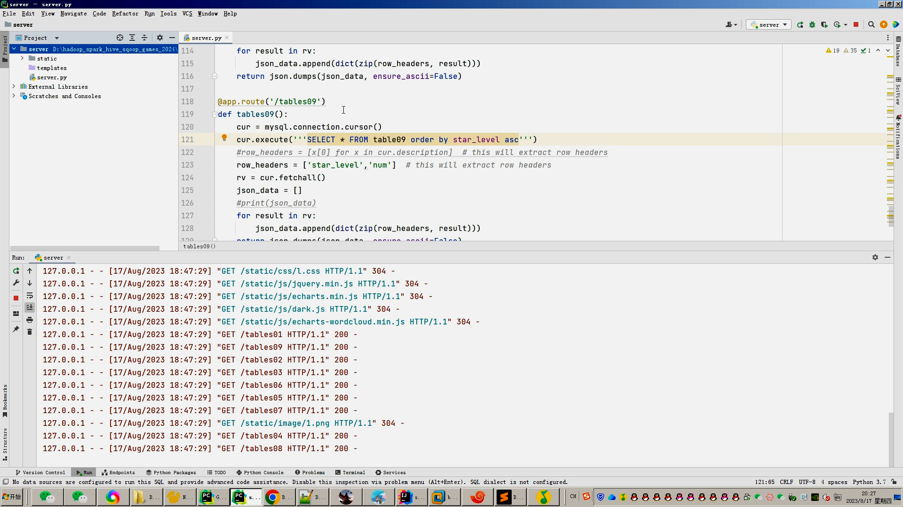
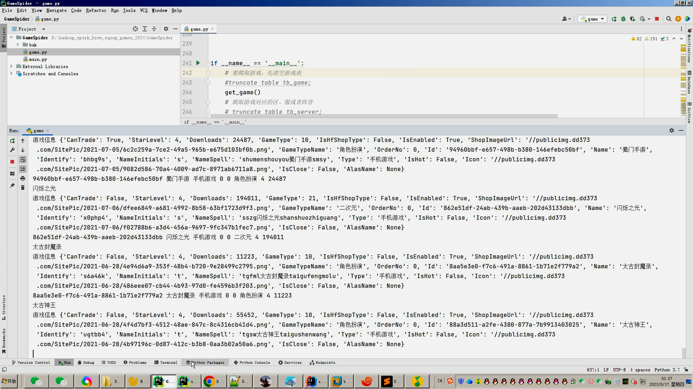
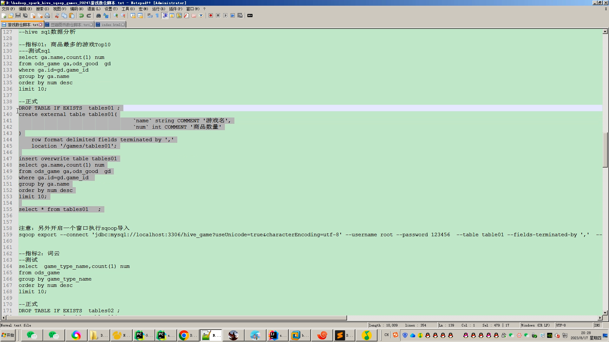
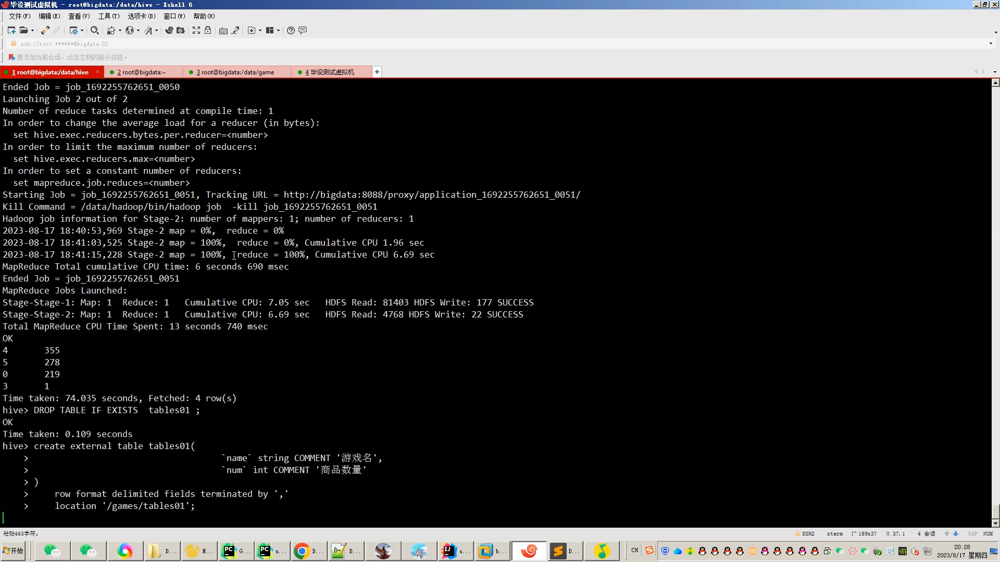
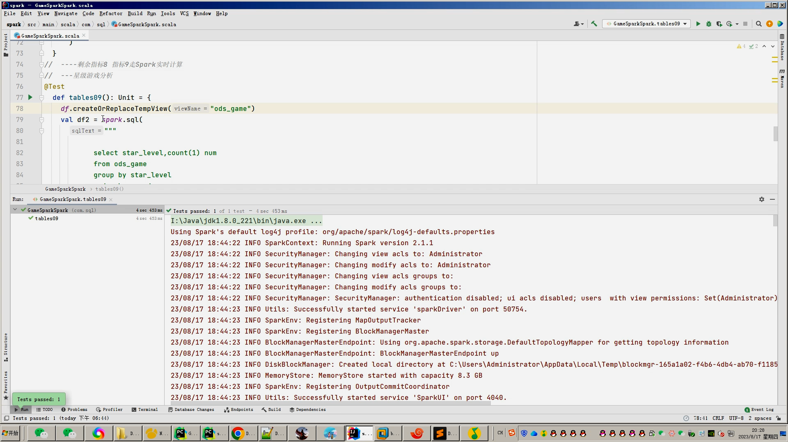
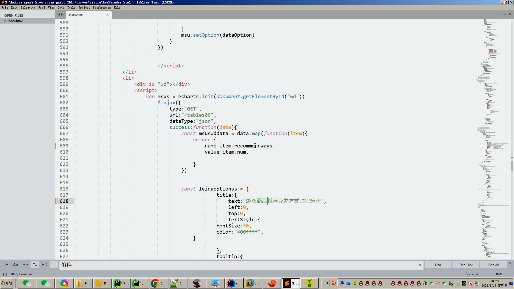
## 开发技术：
spark hadoop hive 装杯显摆虚拟机Linux敲命令炫酷吊打 flask echarts sqoop scala hdfs yarn mysql requests爬虫框架等；

## 流程： 

1.Python爬取steam或者其他游戏站点数据存到.csv和mysql数据库(双备份)；

2.将.csv文件上传到hdfs文件系统；

3.使用hive建表建库，并且导入.csv文件建立数据仓库;

4.一半分析指标使用hive_sql完成，一半分析指标使用Spark完成；

5.分析结果使用sqoop导入mysql数据库；

6.使用Flask+echarts搭建可视化大屏；

## 创新点：
Python爬虫、可视化大屏、离线数仓hive+实时计算Spark双结合双实现防止导师喷人、使用vmvare虚拟机模拟大数据环境等

如果他(导师)还是狂喷不止，继续选择以下的系统，他们可以选装牛鼻功能！

## 可选装项目模块如下：
1.推荐系统(4种深度学习推荐算法 协同过滤基于用户 基于物品 SVD神经网络 MLP)。附带AI、支付、短信、lstm情感分析。
2.预测系统(KNN CNN RNN卷积神经预测 K-means 线性回归)。
3.知识图谱neo4j可视化关系网络图。
4.后台管理系统。

选装视频效果如下：
https://www.bilibili.com/video/BV1PA411Q7iC/?spm_id_from=333.999.0.0

https://www.bilibili.com/video/BV1Eg41147So/?spm_id_from=333.999.0.0

